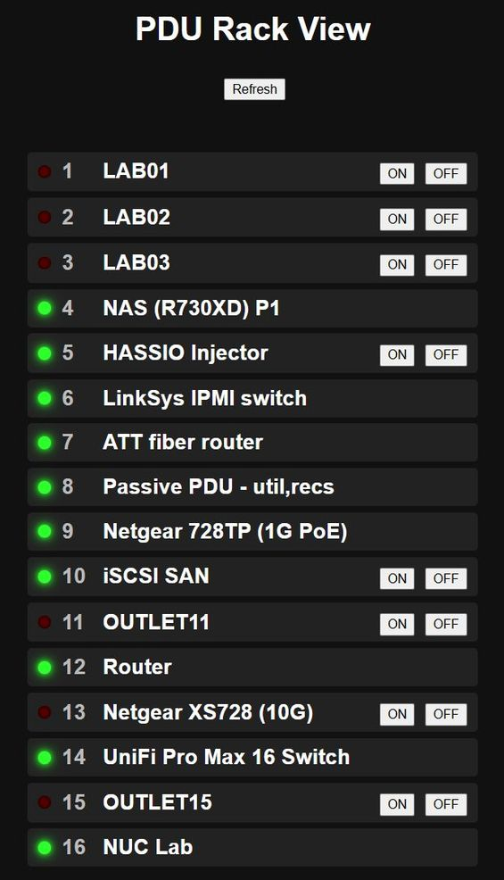
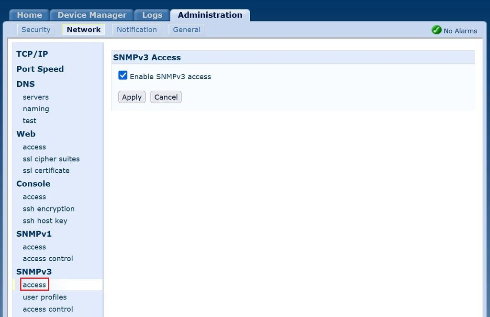
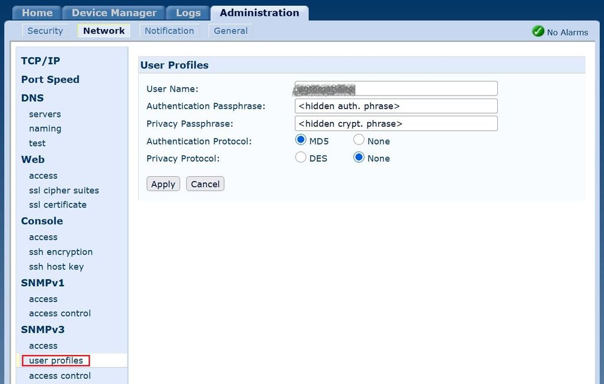

# PDU Web SNMP

A lightweight web management interface for the APC AP7902 Power Distribution Unit (PDU) using SNMP v3 protocol.

<p align="center">
  
</p>

## Overview

PDU Web SNMP provides a simple, web-based interface to monitor and control individual power outlets on an APC AP7902 PDU. 
The application communicates with the PDU via SNMP v3 and retrieves credentials securely from HashiCorp Vault.

## Features

- **Web-based Interface** - Clean, intuitive web dashboard for PDU management
- **Outlet Control** - Turn outlets ON/OFF remotely via the web interface
- **Status Monitoring** - Real-time view of outlet status and names
- **Secure Credentials** - Integration with HashiCorp Vault for credential management
- **Docker Ready** - Containerized deployment with included Dockerfile
- **SNMP v3** - Secure SNMP protocol with authentication

## Technology Stack

- **Backend**: Python 3.13 with Flask
- **Frontend**: HTML5
- **Protocols**: SNMPv3
- **Credentials Management**: HashiCorp Vault with AppRole authentication
- **Configuration**: YAML and environment variables
- **Containerization**: Docker

## Prerequisites

### System Requirements
- Python 3.13 or later
- Docker (for containerized deployment)

### External Dependencies
- APC AP7902 PDU with SNMP v3 enabled
- HashiCorp Vault server configured with KV v2 secrets

## Installation

1. **Clone the repository**
   ```bash
   git clone https://github.com/cybercat70/pdu-web-snmp.git
   cd pdu-web-snmp
   ```

2. **Build the Docker image**
   ```bash
   ./docker-build
   ```

3. **Create configuration files on the host machine**
   ```bash
   mkdir -p /etc/pdu-web-snmp
   cp etc/pdu-web-snmp/.env.example /etc/pdu-web-snmp/.env
   cp etc/pdu-web-snmp/pdu_devices.yaml.example /etc/pdu-web-snmp/pdu_devices.yaml
   ```

4. **Copy your CA certificate (ca.crt, or refer to .env.example) to /etc/pdu-web-snmp**

5. **Update configuration files with actual values**
   ```bash
   # Edit /etc/pdu-web-snmp/.env
   # Edit /etc/pdu-web-snmp/pdu_devices.yaml
   ```

6. **Run the Docker container**
   ```bash
   docker run -d \
     -p 5000:5000 \
     --name pdu-web-snmp \
     -v /etc/pdu-web-snmp:/etc/pdu-web-snmp:ro \
     pdu-web-snmp:latest
   ```

7. **Install as systemd service (optional)**
   ```bash
   sudo cp pdu-web-snmp-docker.service /etc/systemd/system/
   sudo systemctl daemon-reload
   sudo systemctl enable pdu-web-snmp-docker.service
   sudo systemctl start pdu-web-snmp-docker.service
   ```

## Configuration

### Environment Variables (.env)
```text
Variable     | Description                      | Example
-------------+----------------------------------+--------------------------
VAULT_ADDR   | HashiCorp Vault server URL       | https://vault.example.com
CA_CERT      | Path to CA certificate for Vault | /etc/pdu-web-snmp/ca.crt
VAULT_ROLE   | Vault AppRole role ID            | 4f826560-...
ID           | Vault AppRole secret ID          | d714a493-...
```

### Device File Configuration (pdu_devices.yaml)

```yaml
# Name              Outlet index
HOST01:             1
HOST02:             2
SERVER:             10
SWITCH:             13
```

The device names in the file are placeholders, you can configure them as you see fit. 
The actual names used by the web interface are read from the PDU configuration.
Only outlets mapped in pdu_devices.yaml can be controlled, to prevent critical devices from being accidentally turned off.

### Vault Setup

The application uses HashiCorp Vault AppRole authentication to retrieve PDU credentials. 
Configure your Vault instance with:
```text
Mount Point: lab (KV v2)
Secret Path: pdu-web
Secret Keys:
  host:          PDU IP address or hostname
  snmp_user:     SNMPv3 username
  snmp_password: SNMPv3 password/auth key
```
Or manually edit "vault.py" to match your Vault configuration :).

### Vault AppRole configuration
[TBD]

### AP7902 SNMP v3 configuration specifics

- Login to the Web management GUI of AP7902.
- Navigate to Administration -> Network -> SMNPv3 -> access
- Enable SMNPv3:

<p align="center">
  
</p>

- Navigate to Administration -> Network -> SMNPv3 -> user profiles
  and choose a user profile:

<p align="center">
  
</p>

- Set the username, authentication passphrase, choose MD5 as auth protocol (secirity level "authNoPriv").
  I **do not** recommend setting a privacy protocol or privacy passphrase. 
  This enables the highest SNMPv3 security level (authPriv), which uses both authentication and encryption. 
  On the AP7902, however, authPriv causes a severe performance impact because the hardware is simply too old 
  and underpowered, even with the latest firmware installed.

<p align="center">
  
</p>

- Navigate to Administration -> Network -> SMNPv3 -> access control

<p align="center">
  
</p>

- Ensure that the user is enabled.
- (optional) As an additional security measure, restrict this user 
  to the specific IP address or FQDN of the host that will be sending management requests, 
  instead of leaving the default value of 0.0.0.0.
- **Reboot the PDU's management interface.**The SNMPv3 settings will not take effect until it has been restarted
  (it will not reset or restart the device itself).


# Usage

## Web Interface

1. Open browser to http://localhost:5000
2. View the status of all configured outlets
3. Click outlet buttons to turn power ON/OFF
4. Only outlets mapped in pdu_devices.yaml can be controlled

## API Endpoints

### Get Outlets Status
```bash
curl http://localhost:5000/status
```

Response:
```json
[
  {
    "id": 1,
    "name": "HOST01",
    "state": "ON",
    "controllable": true
  },
  {
    "id": 2,
    "name": "HOST02",
    "state": "OFF",
    "controllable": false
  }
]
```

### Control Outlet
```bash
curl -X POST http://localhost:5000/control \
  -H "Content-Type: application/json" \
  -d '{"id": 1, "action": "on"}'
```

Response:
```json
{
  "ok": true,
  "id": 1,
  "state": "ON"
}
```

# Security Considerations

- SNMPv3 Authentication: Passwords are never stored locally; retrieved from Vault at runtime
- Vault Integration: Uses AppRole authentication for secure credential management
- Non-root User: Container runs as unprivileged user (pdu-web)
- Read-only Config: Docker mounts configuration as read-only
- HTTPS Recommended: For production, deploy behind a reverse proxy with HTTPS
